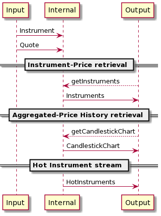
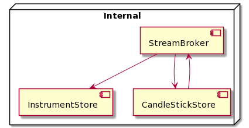
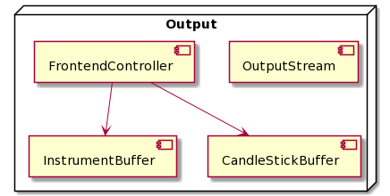
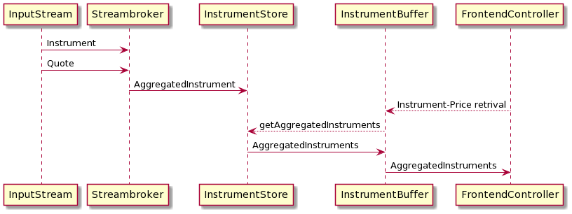
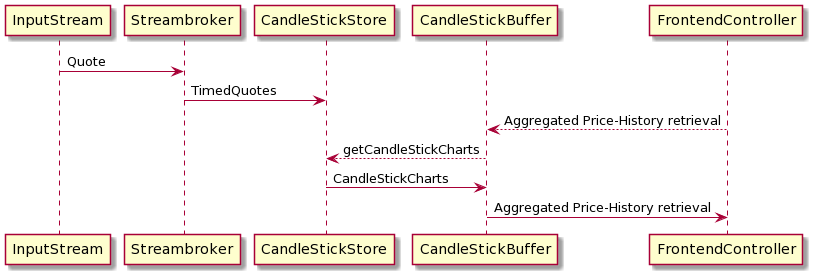
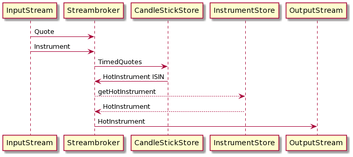

# Quotes System
# How to Run
Run `docker compose up` in the project folder

Application can also be started with `mvn spring-boot:run` or `java -jar quotesSystem-1.0.0.jar`

In case of docker compose, partnerService gets deployed automatically, otherwise it needs to be started separately. It is also possible to build a standalone application docker image. However, it should be ran with default profile (remove  `-Dspring.profiles.active=docker` from Dockerfile)

By default, the application runs on `localhost:8888` and provides following endpoints:
* `/instruments`: Instrument-Price retrieval
* `/page/{id}`: Bonus Endpoint that display a subset of Instruments
* `/instruments/{id}`:Aggregated Price-History retrieval
* HotInstrument stream is accessible through `ws://localhost:8888/hotInstruments`
* `/client`: Provides a JavaScript Browser Client that can display the HotInstrument stream

#Config
Configuration is done over the `application.properties` File. An additional Profile (docker) is provided for docker compose

#Testing
* Internal Logic ist tested with Unit Tests
* End-to-End Testing was performed manually, with support of log output in DEBUG mode

# Architecture Documentation

The QuotesSystem uses a three-layer architecture, consisting of Input Layer, Internal Layer and Output Layer

##Input-Layer
Consists of an InputStream that establishes Websocket connection to PartnerService and forwards data to Internal layer

##Internal-Layer

###Streambroker
Distributes data from InputStream to other two components and sends hot Instruments to OutputStream
###InstrumentStore 
Responsible for creating and storing internal representation of Instruments
###CandleStickStore
Responsible for creating and storing CandleStick charts. Also informs StreakBroker about hot Instruments

##Output-Layer

###InstrumentBuffer
Stores currently available Instruments for the Frontend

###CandleStickBuffer
Stores current Candlestick charts for the Frontend

###FrontendController
Exposes REST Endpoints for the Frontend Service

###OutputStream
Communicates HotInstruments to the Frontend Service over websocket connection

# Instrument-Price retrieval

StreamBroker receives Instrument and Quote data from InputStream and passes them on to InstrumentStore, where they get aggregated and stored until required by the Frontend.

InstrumentStore stores the data in a HashMap which makes the storage and the access of individual AggregatedInstruments very cheap.
However, when InstrumentBuffer wants to retrieve all the data, the operation is rather expensive, as the HasMap needs to be transformed into a Collection (*O(n)* time complexity). This can lead to problems if there is a high amount of requests in the Frontend.

To mitigate this problem, I came up with two solutions:

First, I implemented a cashing mechanism in the InstrumentBuffer. Recieved data from InstrumentStore gets cached for a limited amount of time. Thus, every further Frontend request will use the cache and omit the expensive operation. The drawback of this solution is that the user doesn't get data that is fully up to date, however, if the caching duration isn't too long (currently set at 10sec), this should be an acceptable trade off.

For my second solution I focused on the scalability problem that might occur when the System deals with 50.000 instruments. Here, I took into account that the result will be probably displayed on a mobile device, where representing of 50.000 elements at once is not feasible. Thus, I implemented an optional `/page` endpoint which displays only a limited amount of Instruments. In the current implementation, this feature is only a proof of concept as paging doesn't really prevent the expensive HashMap-to-List transformation. However, if we were to use a different data structure, (e.g. a tree map), paging could lower the cost considerably (displaying only one leaf node of data at a time). 

#Aggregated Price-History retrieval

The sequence diagram is very similar to the first assignment. Here the challenge was the transformation of raw price data into CandleSticks.

My solution was to enrich each Quote with a timestamp and save them in a List. Once a Quote with a Timestamp belonging to the next minute arrives, all the data in the List gets compressed to a CandleStick, List gets emptied out, and the process can start anew for the next minute. I went with this solution, as it is highly scalable (multiple worker instances can timestamp Quotes and push them to persistence layer) and in case of an instance outage, it is still possibly to retroactively transform the Quote data into CandleSticks (with some additional effort).

*Note:* This algorithm only works as long as we are guaranteed to get at least one price per minute. As we are expected to get a price every few seconds from the Partner System, I see this assumption as given. Still, in a real implementation, we would have to handle this exception (check if more than one minute has passed, if so, retroactivly create a CandleStick for the missed minute).

As CandleSticks get created once per minute, we are able to cash the current charts up to a minute in CandleStickBuffer, without sacrificing any accuracy.

#Hot Instrument stream

Here I worked under the assumption that the goal of this feature was the display of highly volatile Instruments, to provide Day Traders with business opportunity. The way I understood the assignment, an instrument that rises by over 10%, flatlines for 5 minutes and then rises again by 10%, doesn't fulfill the requirement of high volatility. Thus, an instrument that already rose by over 10% only becomes interesting again once it falls by over 10% (vice verse for 10% fall followed by 10% rise). So, an instrument gets displayed the first time it has a +/10% change, then it gets a velocity tag attached (RISING/FALLING) and only gets displayed again once the velocity changes through a -/+10% difference.

As I already implemented CandleStick in second assignment, the data structure was reused for this task. As each CandleStick saves the highest and lowers price in a minute interval, we just have to look at the CandleStick 5 minutes ago and see if it's lowest value*110% would be higher than the current highest value (for former highest and current lowest value respectively). This introduces a certain inaccuracy into the System, as the two values could be as much as 5 minutes or as little as 3 minutes apart, but I believed that for this use case it was more important to see the highest change in price, rather than compare the current value to the one exactly 360 seconds ago.

#Future Development Discussion
##Scalability & Failover Support
Rather than focusing on improvements that can be done by Operations (e.g. horizontal and vertical scaling), as a Backend Engineer, my goal was to design the system in a way that would scalability and parallelization should the need arise in the future.

Other than the InstrumentStore and CandleStickStore (which can serve as Facade for persistence layer), all the components in the system are stateless, and I kept interdependency between them to a minimum. This will allow for easy scalability and parallelization.

I analysed the memory requirement (See InstrumentationExample in `/src/test/java/com/example/websocket/instrument`), and even with 50.000 Instruments and up to 3.000.000 Quotes per minute, the memory requirement remains in megabyte range, which appears manageable.

In my opinion, the biggest risk is in the Frontend, where too many requests can cause an (unintended) denial of service failure. This risk can be midigated through cashing and paging. 

As CandleStickBuffer, InstrumentBuffer and FrontendController are all stateless and not interdependent, each of them can be deployed and scaled separately, should the need arise due to high load.